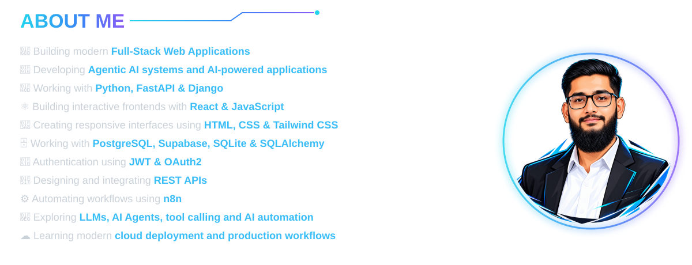

<div align="center">





</div>





# 🎓 Aᴄᴀᴅᴇᴍɪᴄ Bᴀᴄᴋɢʀᴏᴜɴᴅ

**[Benazir University Nawabshah]**  
[BSc / ADS (science)] • [2024 - 2026]

### Certifications

**Agentic AI Fundamentals — Level 1**  
Completed with **78%**

**PIAIC**  
Artificial Intelligence • Cloud • Agentic AI


# 🚀 Fᴇᴀᴛᴜʀᴇᴅ Pʀᴏᴊᴇᴄᴛs

> ▸ Click an arrow below to expand and explore ▸

## 🌐 Full-Stack Development

<details>

<summary><b>📝 Full-Stack Blog Application</b></summary>

<br>

A full-stack blog platform with a React frontend and FastAPI backend connected to PostgreSQL.

### Features

- Modern React frontend
- REST API backend
- Blog CRUD operations
- User authentication
- JWT authorization
- PostgreSQL database
- SQLAlchemy ORM
- Pydantic validation
- Pagination
- Search functionality
- CORS configuration
- Supabase PostgreSQL
- Cloud deployment

### Tech Stack

`React` `JavaScript` `CSS` `Python` `FastAPI` `PostgreSQL` `SQLAlchemy` `JWT` `Supabase`

</details>

---

<details>

<summary><b>✅ Todo Full-Stack Application</b></summary>

<br>

A Todo application for practicing frontend-to-backend communication and database-driven API development.

### Features

- Create tasks
- Read tasks
- Update tasks
- Delete tasks
- Track completion
- REST API integration
- Database persistence

### Tech Stack

`HTML` `CSS` `JavaScript` `Python` `FastAPI` `SQLAlchemy` `SQLite`

</details>

---

## 🤖 Agentic AI & AI Applications

<details>

<summary><b>🎙️ Jarvis — AI Voice Assistant</b></summary>

<br>

An intelligent Python voice assistant capable of understanding commands, using APIs, answering questions and automating tasks.

### Features

- Voice recognition
- Text-to-speech
- AI-powered responses
- Open websites
- Play music
- Fetch latest news
- Execute commands
- API integrations
- Automated workflows

### Tech Stack

`Python` `AI Agents` `SpeechRecognition` `Edge TTS` `AsyncIO` `REST APIs`

</details>

---

<details>

<summary><b>📰 AI News Agent</b></summary>

<br>

An AI agent capable of retrieving and presenting current news using external APIs and tool calling.

### Tech Stack

`Python` `OpenAI Agents SDK` `Chainlit` `NewsAPI` `Tool Calling`

</details>

---

<details>

<summary><b>🌍 IP Geolocation Agent</b></summary>

<br>

An intelligent AI agent capable of retrieving geographical information about IP addresses.

### Tech Stack

`Python` `AI Agents` `REST APIs` `ipapi`

</details>

---

<details>

<summary><b>₿ Crypto Price Agent</b></summary>

<br>

AI-powered cryptocurrency assistant capable of retrieving market prices using the Binance API.

### Tech Stack

`Python` `AI Agents` `Binance API` `REST APIs`

</details>

---

<details>

<summary><b>🐙 GitHub MCP Agent</b></summary>

<br>

An AI agent connected with GitHub through MCP tools for interacting with repositories and developer workflows.

### Tech Stack

`Python` `AI Agents` `MCP` `GitHub` `Tool Calling`

</details>


## ⚙️ Automation

<details>

<summary><b>📧 Email Automation Agent</b></summary>

<br>

Automated email workflow capable of processing emails and generating intelligent responses.

### Tech Stack

`n8n` `Gmail` `AI Agents` `Automation`

</details>

---

<details>

<summary><b>📱 WhatsApp Automation</b></summary>

<br>

Workflow automation experiments involving WhatsApp messaging and AI-powered automation.

### Tech Stack

`n8n` `WhatsApp API` `Automation` `AI`

</details>


## 📚 AI & Educational Platforms

<details>

<summary><b>🤖 Physical AI & Humanoid Robotics Book</b></summary>

<br>

An AI-native educational platform covering Physical AI and Humanoid Robotics.

### Architecture

- Modern documentation frontend
- FastAPI backend
- AI-powered functionality
- PostgreSQL database
- Vector database architecture
- Retrieval-based AI system
- Cloud deployment

### Tech Stack

`Docusaurus` `Python` `FastAPI` `PostgreSQL` `Qdrant` `AI` `RAG`

</details>


# 🛠️ Tᴇᴄʜ Sᴛᴀᴄᴋ

## 🎨 Frontend


## ⚙️ Backend


## 🗄️ Databases


## 🤖 Agentic AI


## ⚡ Automation


## 🧰 Developer Tools


# 🧠 Cᴜʀʀᴇɴᴛ Lᴇᴀʀɴɪɴɢ

Currently expanding my skills in:

- Advanced **JavaScript**
- **React**
- **Tailwind CSS**
- **Django**
- Advanced **FastAPI**
- **PostgreSQL**
- **SQL & SQLAlchemy**
- Full-stack application architecture
- Authentication & authorization
- REST API development
- Backend testing
- Docker
- Cloud deployment
- **Agentic AI**
- AI Agents
- LLM integrations
- Tool Calling
- MCP
- RAG systems
- Workflow automation using **n8n**
- Data Structures & Algorithms


# 🔥 Wʜᴀᴛ I Bᴜɪʟᴅ

```text
Frontend
HTML • CSS • Tailwind CSS • JavaScript • React

            ↓

Backend
Python • FastAPI • Django

            ↓

Database
PostgreSQL • SQLite • Supabase • SQLAlchemy

            ↓

AI Layer
LLMs • AI Agents • RAG • MCP • Tool Calling

            ↓

Automation
n8n • APIs • AI Workflows

            ↓

Deployment
Cloud • Production Applications
```


# 🎯 2026 Fᴏᴄᴜs

```text
Full-Stack Development
        +
Agentic AI
        ↓
Intelligent Web Applications
        ↓
AI Agents
        ↓
Automation
        ↓
Real-World AI Products
```


# 📊 GɪᴛHᴜʙ Sᴛᴀᴛs

<div align="center">


</div>


# 🤝 Cᴏɴɴᴇᴄᴛ Wɪᴛʜ Mᴇ

<div align="center">

[](YOUR_LINKEDIN_URL)

[](mailto:YOUR_EMAIL)

[](https://github.com/M-DaniyalHS1)

</div>


# 🐍 GɪᴛHᴜʙ Cᴏɴᴛʀɪʙᴜᴛɪᴏɴ Sɴᴀᴋᴇ

<div align="center">


</div>


<div align="center">

### Full-Stack • Agentic AI • Automation

**Building intelligent applications from frontend to AI agents.**

⭐ Thanks for visiting my profile!

</div>
